# 🌦 AI Weather Intelligence Platform

An enterprise-grade AI Weather Intelligence Platform built using Python, Streamlit, Plotly, Pandas, and OpenWeather API.

This platform delivers:

* 🌍 Real-time weather monitoring
* 🤖 AI-powered climate analytics
* ⚠ Smart weather risk intelligence
* 📈 Forecast visualization
* 💬 AI weather assistant
* 🌡 Multi-city live monitoring
* 📊 Interactive premium dashboards

---

# 🚀 Live Features

## ✅ Real-Time Weather Monitoring

Track live weather conditions from multiple cities across the world.

The dashboard continuously monitors:

* Temperature
* Humidity
* Wind Speed
* Pressure
* Rain Probability
* Weather Conditions
* Climate Risk Levels

---

## 🤖 AI Climate Intelligence Engine

The platform contains an intelligent weather analytics system that automatically:

* Detects heatwaves
* Detects storm probabilities
* Detects high-risk weather conditions
* Monitors atmospheric instability
* Calculates smart climate risk levels

---

## ⚠ Smart Risk Detection System

AI Risk Engine automatically classifies weather conditions into:

* LOW
* MEDIUM
* HIGH
* EXTREME

Risk calculations are based on:

* Temperature
* Humidity
* Wind speed
* Rain conditions

---

# 📊 Dashboard Modules

## 🌍 Monitoring Center

A premium real-time monitoring interface with:

* Multi-city tracking
* Colorful live analytics table
* Climate activity monitoring
* Environmental intelligence
* Real-time API integration

---

## 📈 Forecast Analytics

Forecast system provides:

* Temperature forecasting
* Weather trend analysis
* Forecast visualizations
* Future climate predictions

---

## 💬 AI Weather Assistant

Interactive AI assistant for weather insights.

Users can ask:

* Which city is hottest?
* Which region is unsafe?
* Where is heavy rainfall expected?
* Which city has highest humidity?
* What is the current climate risk?

---

## ⚠ Risk Intelligence Dashboard

Interactive climate risk visualization system using Plotly charts.

Includes:

* Risk distribution charts
* Extreme condition monitoring
* Climate severity analysis
* Global weather analytics

---

# 🧠 Technologies Used

| Technology                | Purpose                |
| ------------------------- | ---------------------- |
| Python                    | Backend Logic          |
| Streamlit                 | Dashboard UI           |
| Plotly                    | Interactive Charts     |
| Pandas                    | Data Processing        |
| OpenWeather API           | Real-Time Weather Data |
| Machine Learning Concepts | Risk Intelligence      |

---

# 📂 Project Structure

```text
AI-Weather-Intelligence-Platform/
│
├── dashboard.py
├── requirements.txt
├── README.md
│
├── src/
│   ├── api/
│   │   └── weather_api.py
│   │
│   ├── models/
│   │   └── risk_model.py
│   │
│   ├── processing/
│   │   └── data_loader.py
│   │
│   └── visualization/
│       └── charts.py
│
├── assets/
├── outputs/
├── data/
└── notebooks/
```

---

# 🖥 Installation Guide

## STEP 1 — Clone Repository

```bash
git clone https://github.com/sujalkrshaw/AI-Weather-Intelligence-Platform.git
```

---

## STEP 2 — Open Project Folder

```bash
cd AI-Weather-Intelligence-Platform
```

---

## STEP 3 — Install Requirements

```bash
pip install -r requirements.txt
```

---

## STEP 4 — Run Dashboard

```bash
streamlit run dashboard.py
```

---

# 🌐 API Integration

This project uses:

## OpenWeather API

Used for:

* Live weather data
* Forecast analytics
* Real-time climate conditions

API Website:

```text
https://openweathermap.org/api
```

---

# 🎨 UI Features

The platform includes:

* Premium glowing dashboard UI
* Glassmorphism cards
* Gradient backgrounds
* Interactive charts
* Animated dashboard sections
* Enterprise SaaS-style design
* Real-time updates

---

# 📸 Platform Preview

The dashboard contains:

✅ Global monitoring system
✅ AI-powered analytics
✅ Forecast intelligence
✅ Weather risk monitoring
✅ Smart climate visualization
✅ Multi-city tracking

---
# 📸 Project Preview

---

## 🌍 Main Dashboard UI

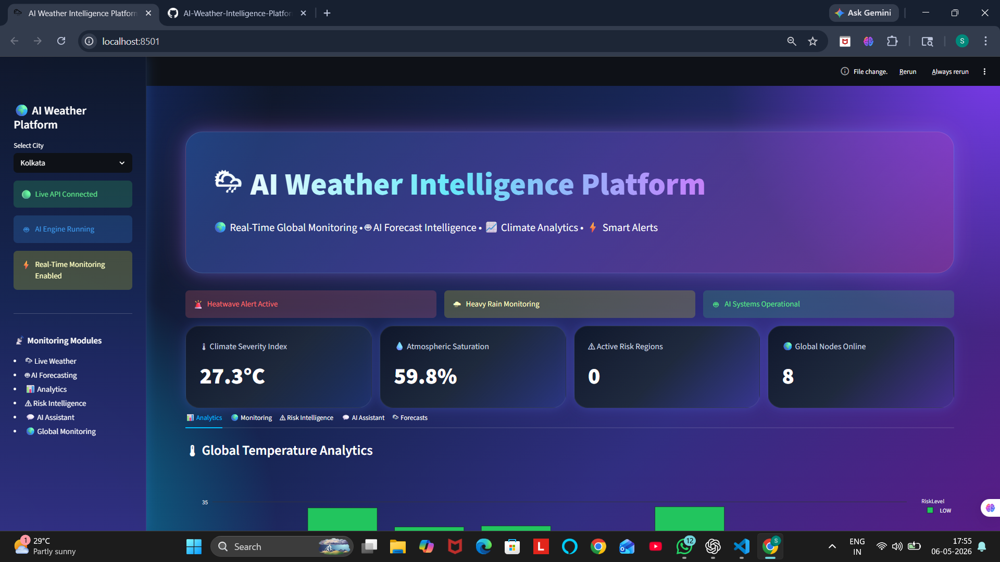

---

## 📊 Temperature Analytics

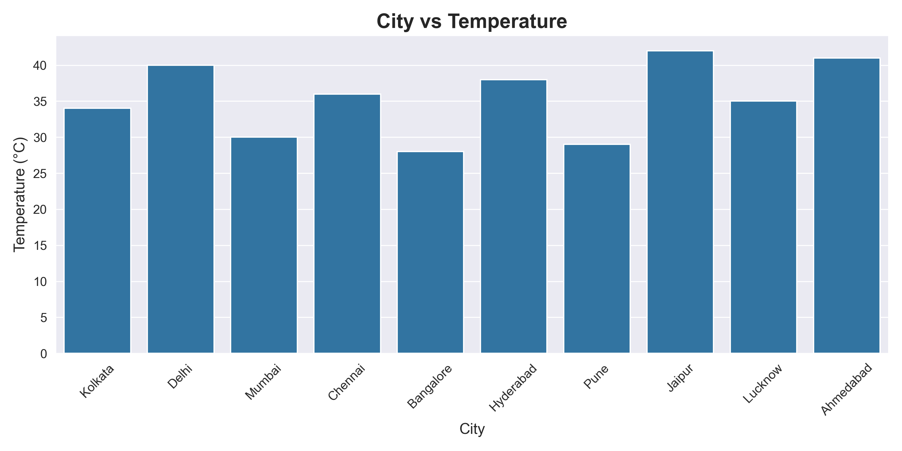

---

## 💧 Humidity Intelligence

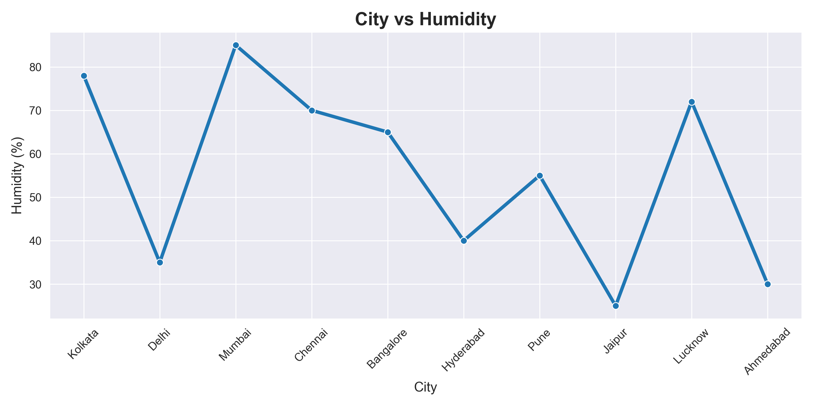

---

## ⚠ Risk Distribution System

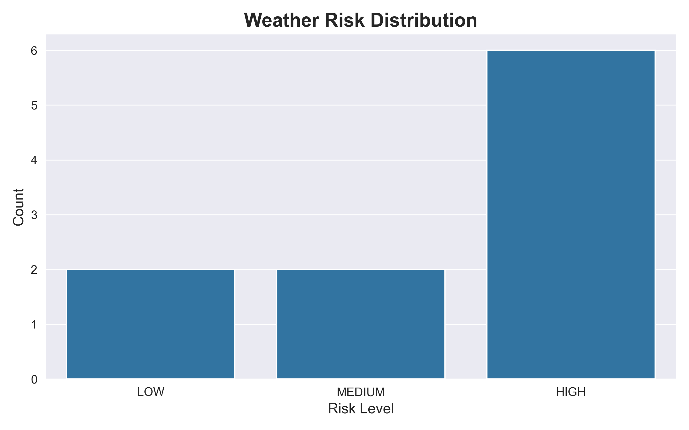

---

## 🤖 AI Weather Assistant

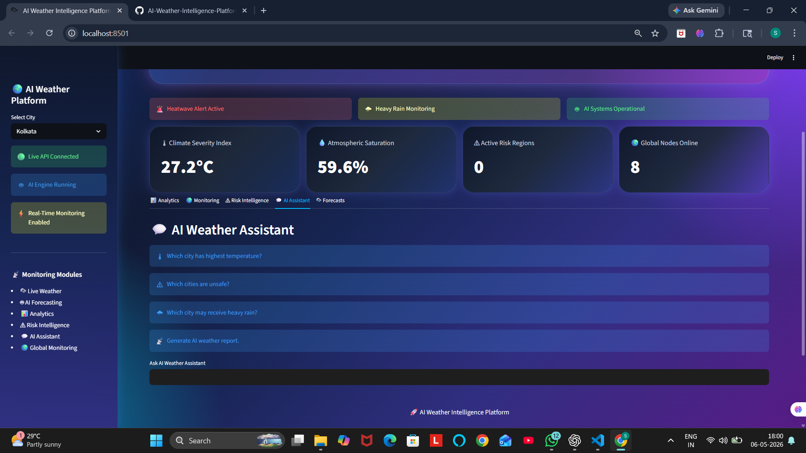

---

## 🌦 Forecast Analytics

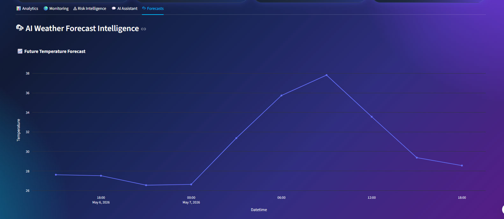

---

## 📈 Forecast Table

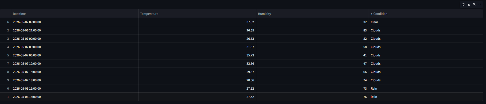

---

## 🌍 Monitoring Center

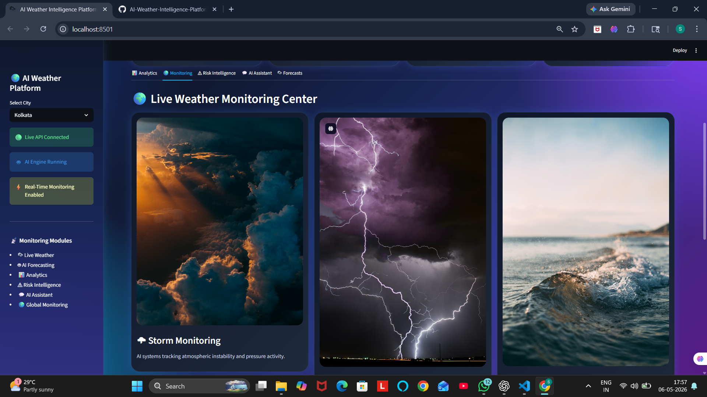

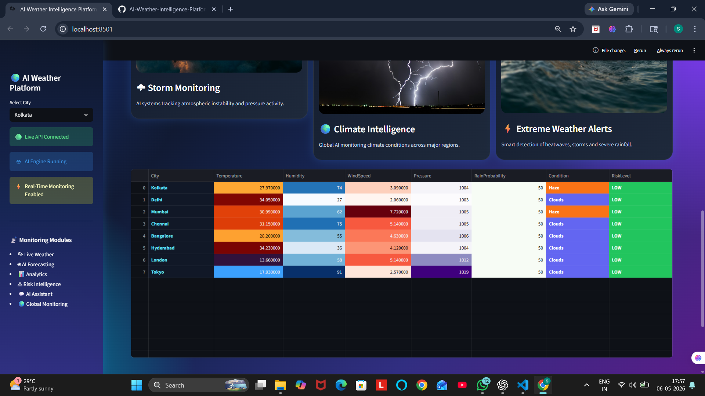

---

## ⚠ Risk Intelligence Dashboard

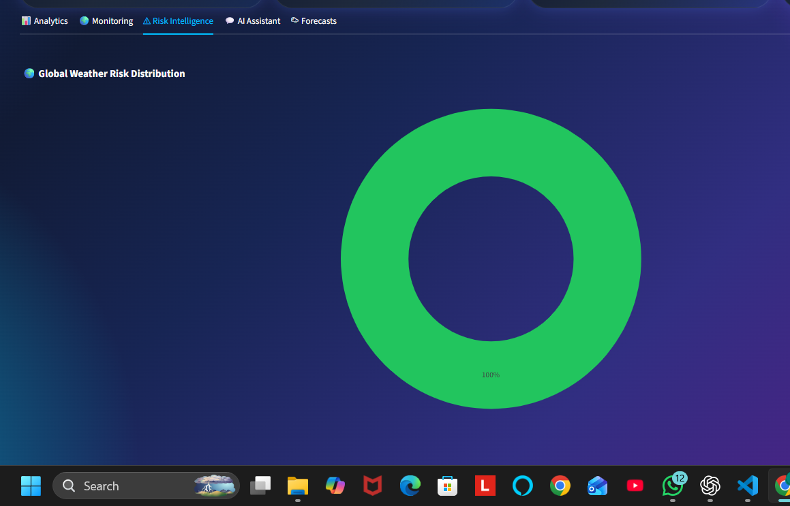

---

## 🔥 Correlation Heatmap

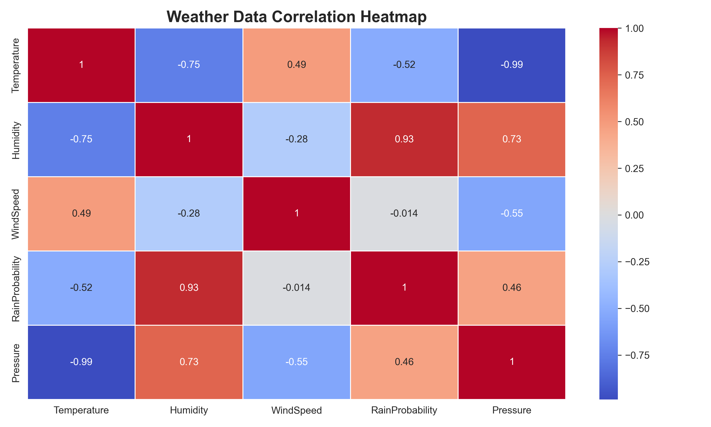

---

## 🧠 Feature Importance Analytics

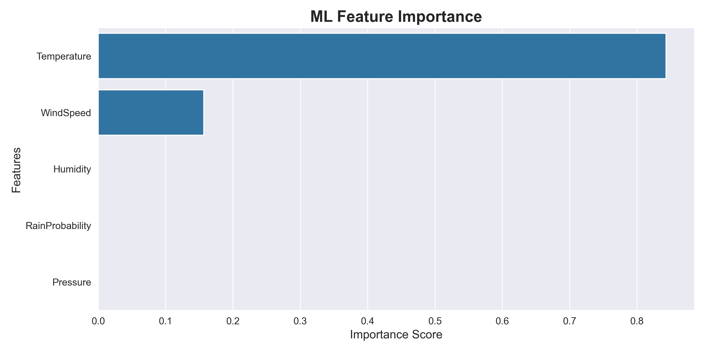

---

## 📊 Advanced Analysis


...

# 🔥 Advanced Features

## Smart Monitoring

The dashboard automatically:

* Refreshes weather data
* Updates analytics
* Tracks climate risks
* Detects atmospheric changes

---

## Interactive Visualizations

Includes:

* Risk Pie Charts
* Temperature Analytics
* Forecast Charts
* Climate Monitoring Tables
* Heatmap-style monitoring grids

---

# 🚀 Future Improvements

Planned future upgrades:

* Satellite weather integration
* AI chatbot integration
* LLM weather intelligence
* WhatsApp alerts
* Email notifications
* IoT weather sensor support
* Cloud deployment
* User authentication
* Mobile app integration
* Business analytics system

---

# 🌍 Business Use Cases

This platform can be used for:

* Climate monitoring companies
* Weather analytics startups
* Smart city projects
* Environmental intelligence systems
* Research dashboards
* Disaster monitoring systems
* AI forecasting platforms

---

# 👨‍💻 Author

## Sujal  kumar Shaw

AI & Data Science Enthusiast

---

# ⭐ Support

If you like this project:

* Star the repository
* Share the project
* Fork the repository
* Contribute improvements

---

# 📜 License

This project is open-source and available for educational and portfolio purposes.

---

# 🚀 Final Note

AI Weather Intelligence Platform combines:

* Artificial Intelligence
* Climate Analytics
* Real-Time Monitoring
* Forecast Intelligence
* Interactive Visualization
* Enterprise Dashboard Design

into one complete intelligent weather analytics system.
